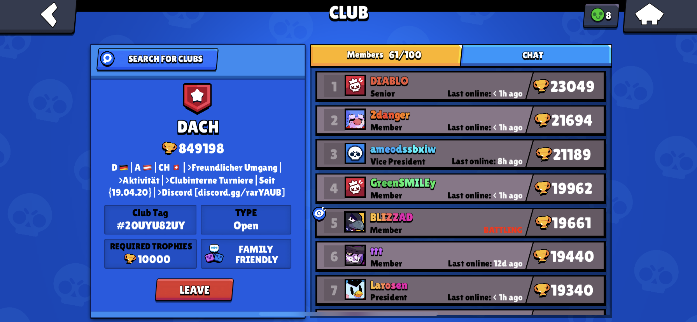


Permissions:

Bot permission: `ADMINISTRATION`<br>User permission: `ADMINISTRATION`


##Description

With this command we can add a Brawl Stars club to the database and link different roles with it. 

##Usage

`-club <add / remove> <role> [club tag] [rank / default]`

| Argument | Description |
| :--- | :--- | 
| club | Command name. |
| add/remove | Add or remove a club from the database. |
| role | The role the member gets when he/she is in the defined club. |
| club tag | The tag from the Brawl Stars club. |
| rank/default | The rank a member must have in the Brawl Stars club to get the role or default if every member from the club should get it. Available ranks are: `Member`, `Senior` or `Vice-President`. |


The role argument must be one word, the role id, the mentioned role, or we can search for it when there are multiple roles with the argument we've inserted.


##How to actually use it



We have the Brawl Stars club with the tag `#20UYU82UY` as shown in the picture above. We also have the role `@DACH_Player` on the Discord server. If we want to give the role `@DACH_Player` to every player who is in the club `#20UYU82UY` when the member verifies himself we have to enter the following command.

```
-club add @Dach_Player #20UYU82UY default
```

If the player must have the rank senior we have to use the following command. (The player will get the role `@Dach_Senior`)

```
-club add @Dach_Senior #20UYU82UY senior
```

When we want to remove the default role from the database we have to enter the following command.

```
-club remove @Dach_Player
```