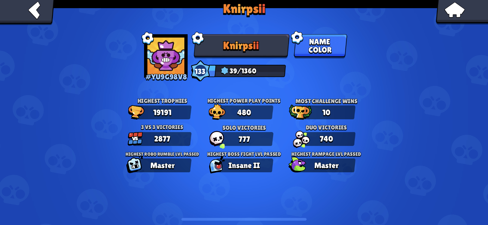


Permissions:

Bot permission: `ADMINISTRATION`<br>User permission: `SEND_MESSAGES`


##Description

With this command you can get yourself some roles, by linking your Brawl Stars profile to your Discord account.

##Usage

`-verify <user Tag> [image]`

| Argument | Description |
| :--- | :--- |
| verify | Command Name |
| usertag | Your Brawl Stars usertag, you can find this in your profile |
| image | This argument is optional, depending on the settings of your server, you might have to add a screenshot of your profile |


##How to actually use it


We have the Discord user `@Knirpsii` whose ingame tag is `#YU9G98V8`. If the image is not necessary, he can run the following command.
```
-verify #YU9G98V8
```


We have the Discord user `@Knirpsii` whose ingame tag is `#YU9G98V8`. If the image is required, he must run the following command with the image added, to get verified.

```
-verify #YU9G98V8
```


